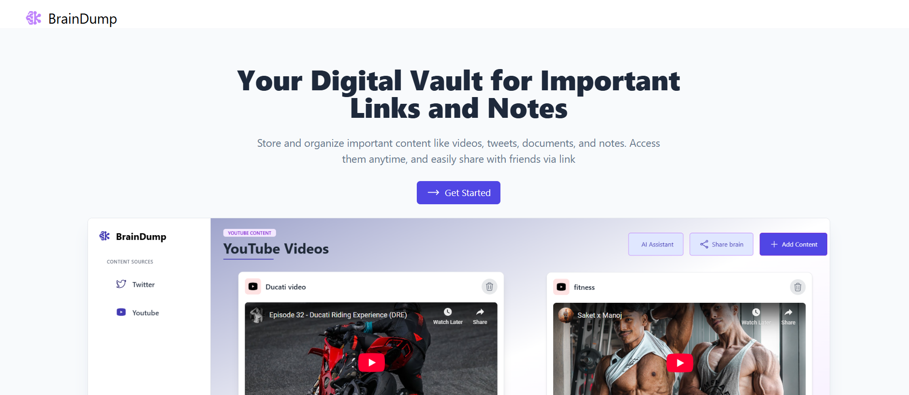

# 🧠 BrainDump

Live Link : https://braindump-alpha.vercel.app/


Your personal knowledge repository for storing and organizing insightful content from the internet.

---

## 🚀 Overview

**BrainDump** is a web platform that lets you collect and organize the YouTube videos and tweets you find insightful, educational, or worth revisiting. Whether you're researching, learning, or just curating valuable content, BrainDump serves as your second brain.

You can also share your collection with others to promote collaborative learning and knowledge exchange.

---



## 🌟 Features

- 📺 Save and organize **YouTube videos**
- 🐦 Save and manage **tweets**
- 🔍 Retrieve your content anytime with ease
- 👥 Share your **Dumpbrain** with others
- ✨ Clean, minimal interface for a distraction-free experience

---

## 🔧 Tech Stack

### Frontend
- **React.js**
- **Tailwind CSS**
- **TypeScript**

### Backend
- **Node.js (Express.js)**
- **MongoDB**

### Security & Validation
- **JWT (JSON Web Tokens)** for authentication
- **Bcrypt** for password hashing
- **Zod** for schema validation

---

### Login credentials 

username : farman123
password : F@rman1234


## 📦 How to Run the Project

### Prerequisites
- Node.js and npm installed
- MongoDB instance (local or cloud)

---

## 📦 Installation

 **Clone the repository**
   ```bash
   git clone https://github.com/farman13/Brain-Dump.git
   cd Brain-Dump
   ```

### Frontend setup

```bash
cd backend
npm install
npm run dev
```

### Backend Setup

```bash
cd backend
npm install
npm run dev
```

### configure .env

```
PORT=5000
MONGODB_URI=your_mongodb_connection_string
JWT_SECRET=your_jwt_secret_key
```


